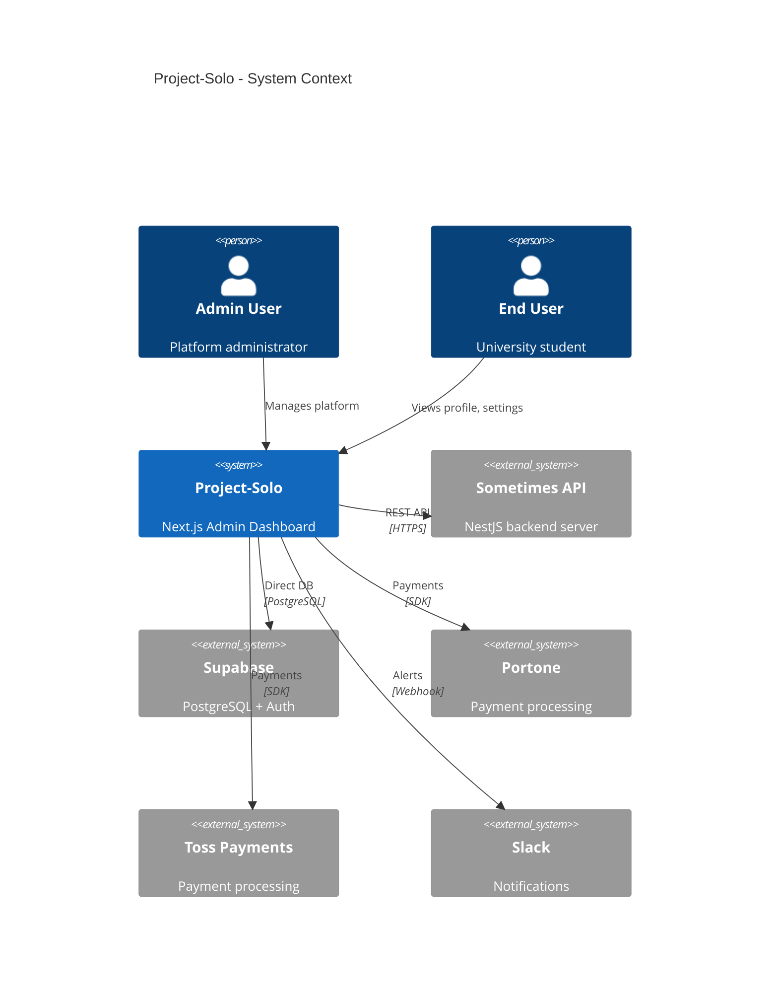
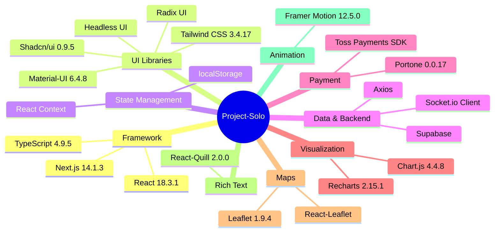
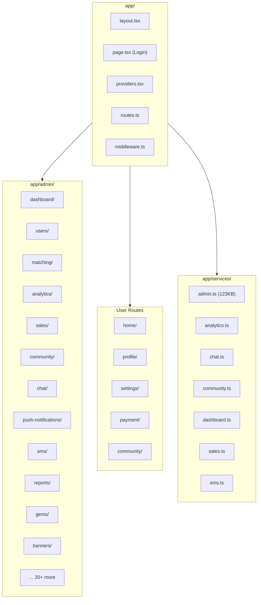
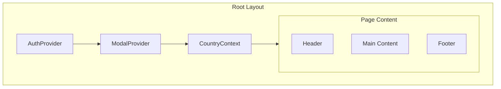
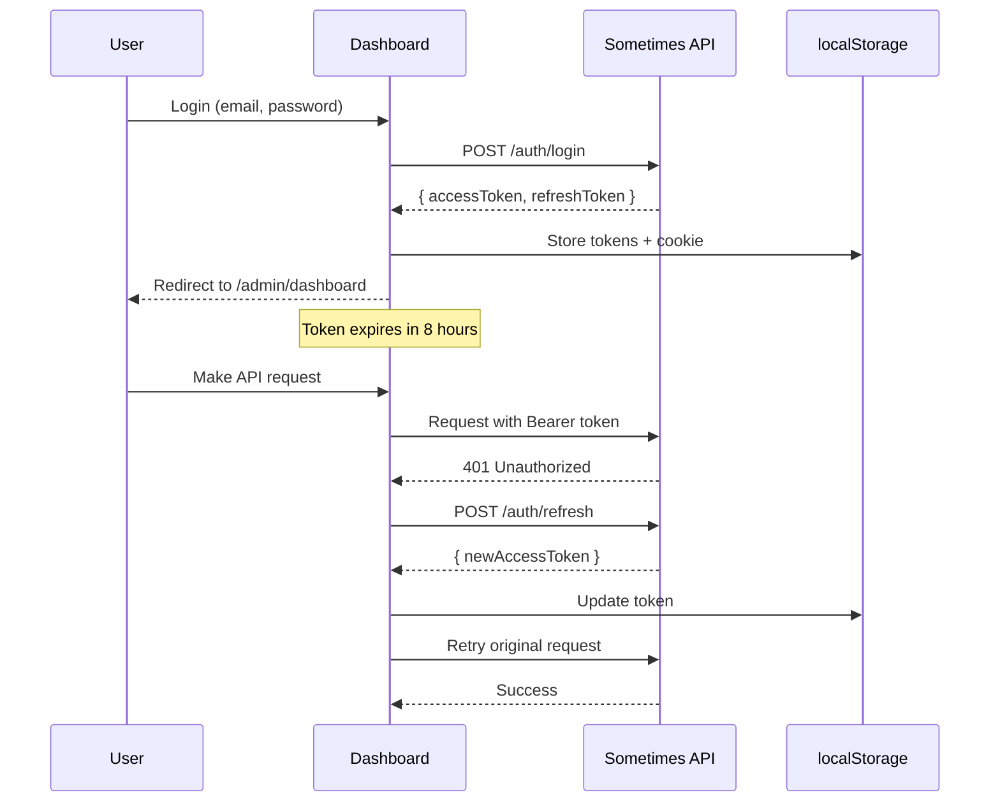
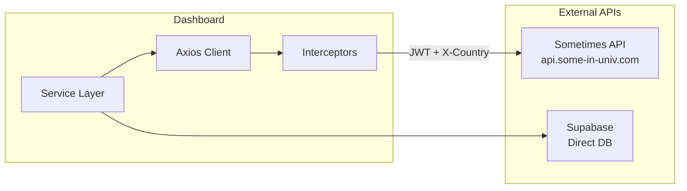
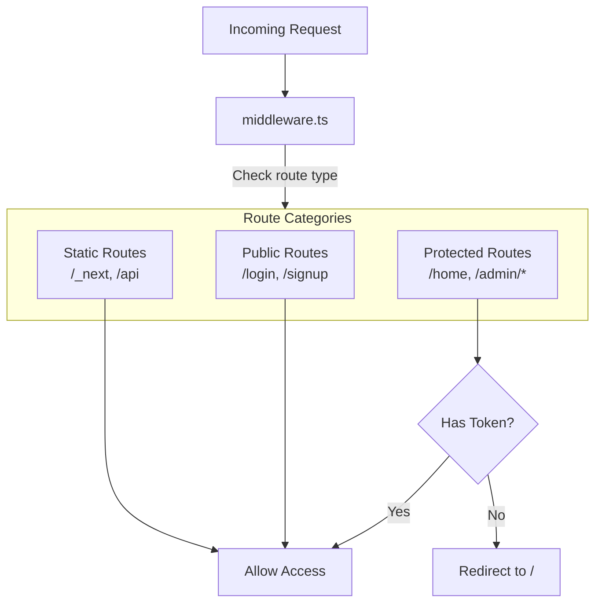

# Project-Solo - System Architecture

## Overview
Next.js 14 Admin Dashboard for university student matching platform management.

## C4 Context Diagram



## Tech Stack



## App Router Structure



## Provider Stack



## Authentication Flow



## API Integration



### Axios Configuration

```typescript
// Three axios instances
axiosServer     // JSON requests (15s timeout)
axiosMultipart  // File uploads (30s timeout)
axiosNextGen    // Direct backend (15s timeout)

// Request interceptor
- Add JWT Authorization header
- Add X-Country header

// Response interceptor
- Auto-refresh token on 401
- Redirect to login on refresh failure
```

## Route Protection



## Key Components

| Layer | Components |
|-------|------------|
| Layout | Header, Navigation, Sidebar, Footer |
| Admin | DashboardAnalytics, UserManagement, MatchingPanel |
| User | ProfileSection, PreferencesSection, MeetingForm |
| Shared | Button, Card, Modal, Calendar, Counter |

## Environment Variables

| Variable | Purpose |
|----------|---------|
| `NEXT_PUBLIC_API_URL` | Backend API URL |
| `NEXT_PUBLIC_SUPABASE_URL` | Supabase project URL |
| `NEXT_PUBLIC_SUPABASE_ANON_KEY` | Supabase anonymous key |
| `SUPABASE_SERVICE_ROLE_KEY` | Supabase admin key |
| `SLACK_WEBHOOK_URL` | Slack notifications |
