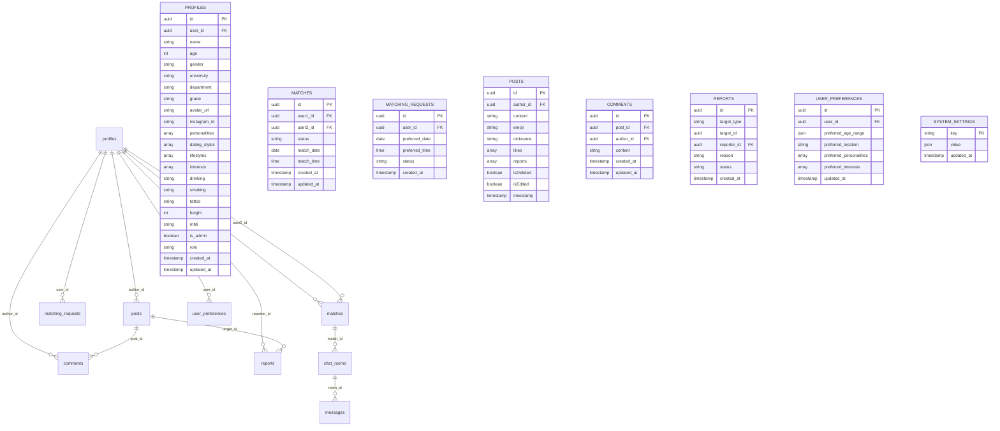
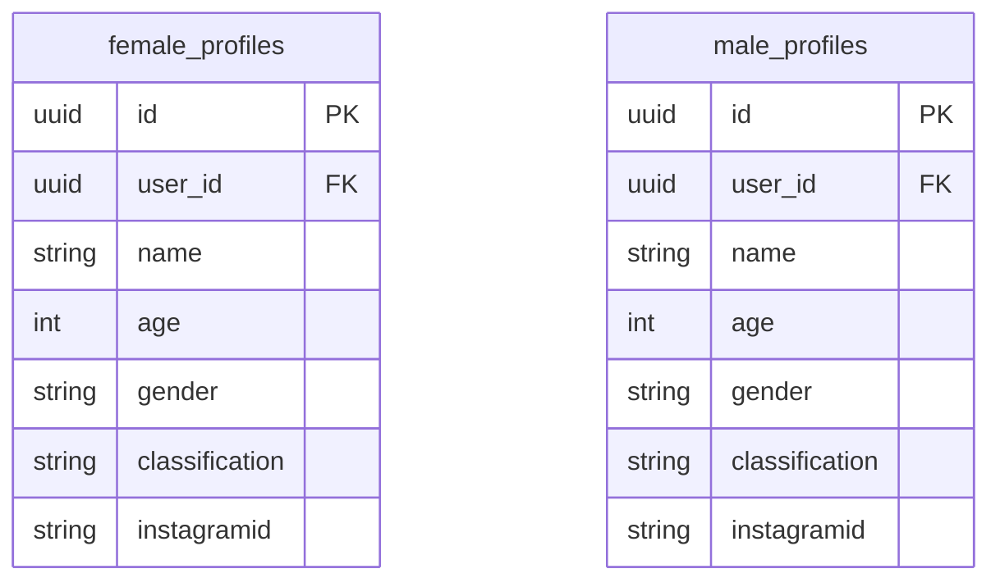
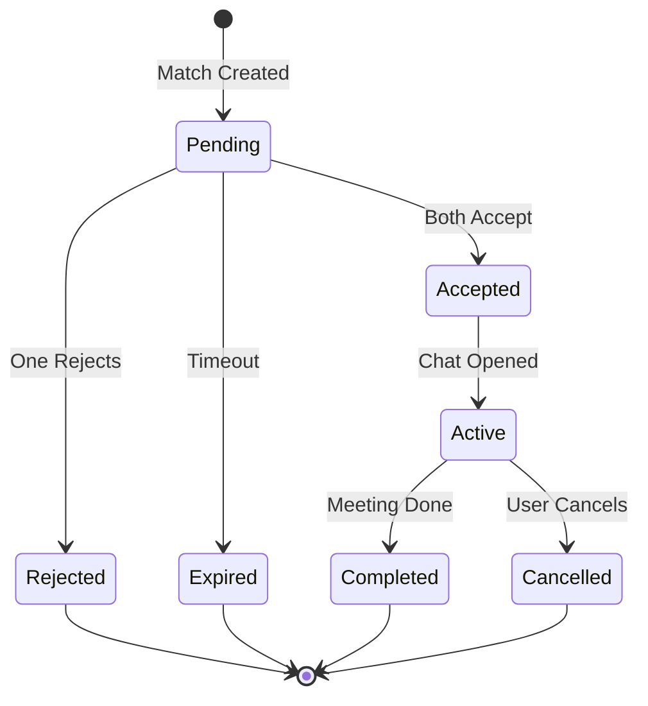
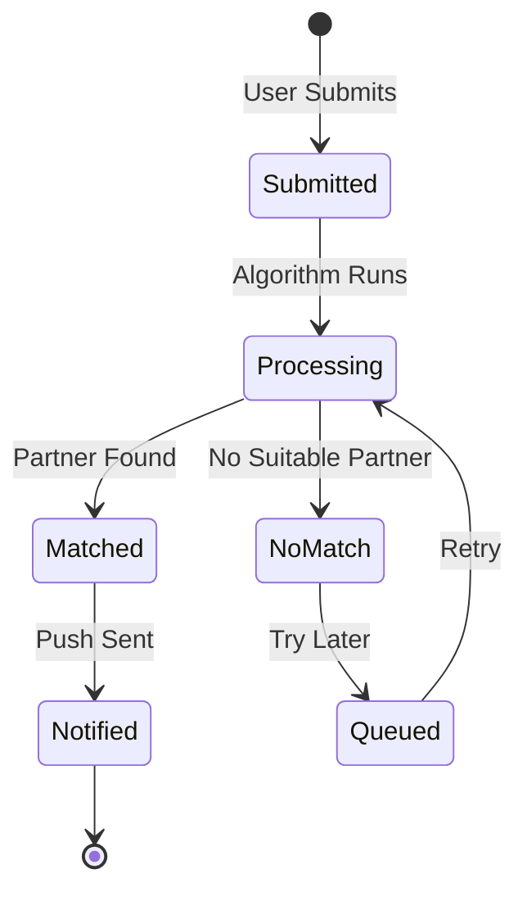

# Project-Solo - Database ERD

## Overview
Supabase PostgreSQL database with auto-generated TypeScript types.

## Core Entity Relationship Diagram



## Gender-Specific Profile Views



## Match Lifecycle



## Matching Request Flow



## Profile Data Structure

```typescript
interface Profile {
  // Identity
  id: string;
  user_id: string;
  name: string;
  age: number;
  gender: 'male' | 'female';
  
  // Education
  university: string;
  department: string;
  grade: string;
  
  // Appearance
  avatar_url: string;
  height: number;
  
  // Personality
  personalities: string[];
  dating_styles: string[];
  lifestyles: string[];
  interests: string[];
  mbti: string;
  
  // Habits
  drinking: 'none' | 'sometimes' | 'often';
  smoking: 'none' | 'sometimes' | 'often';
  tattoo: 'none' | 'small' | 'large';
  
  // Social
  instagram_id: string;
  
  // Admin
  is_admin: boolean;
  role: 'user' | 'admin' | 'super_admin';
  
  // Timestamps
  created_at: string;
  updated_at: string;
}
```

## Key Relationships

| Parent | Child | Relationship | On Delete |
|--------|-------|--------------|-----------|
| profiles | matches | One-to-Many | Cascade |
| profiles | matching_requests | One-to-Many | Cascade |
| profiles | posts | One-to-Many | Set Null |
| profiles | comments | One-to-Many | Cascade |
| posts | comments | One-to-Many | Cascade |
| posts | reports | One-to-Many | Cascade |
| matches | chat_rooms | One-to-One | Cascade |
| chat_rooms | messages | One-to-Many | Cascade |

## Indexes

| Table | Index | Columns | Purpose |
|-------|-------|---------|---------|
| profiles | idx_profiles_user_id | user_id | Auth lookup |
| profiles | idx_profiles_gender | gender | Matching filter |
| profiles | idx_profiles_university | university | Matching filter |
| matches | idx_matches_users | user1_id, user2_id | Match lookup |
| matches | idx_matches_status | status | Status filter |
| matching_requests | idx_requests_date | preferred_date | Scheduling |
| posts | idx_posts_author | author_id | User posts |
| posts | idx_posts_timestamp | timestamp | Feed ordering |

## Database Types Location

```
/Users/smartnewbie/Desktop/Project-Solo/database.types.ts
```

Auto-generated by Supabase CLI, contains:
- All table types
- Insert/Update types
- Enum types
- Function return types
