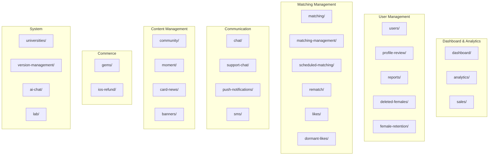
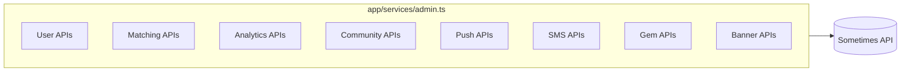
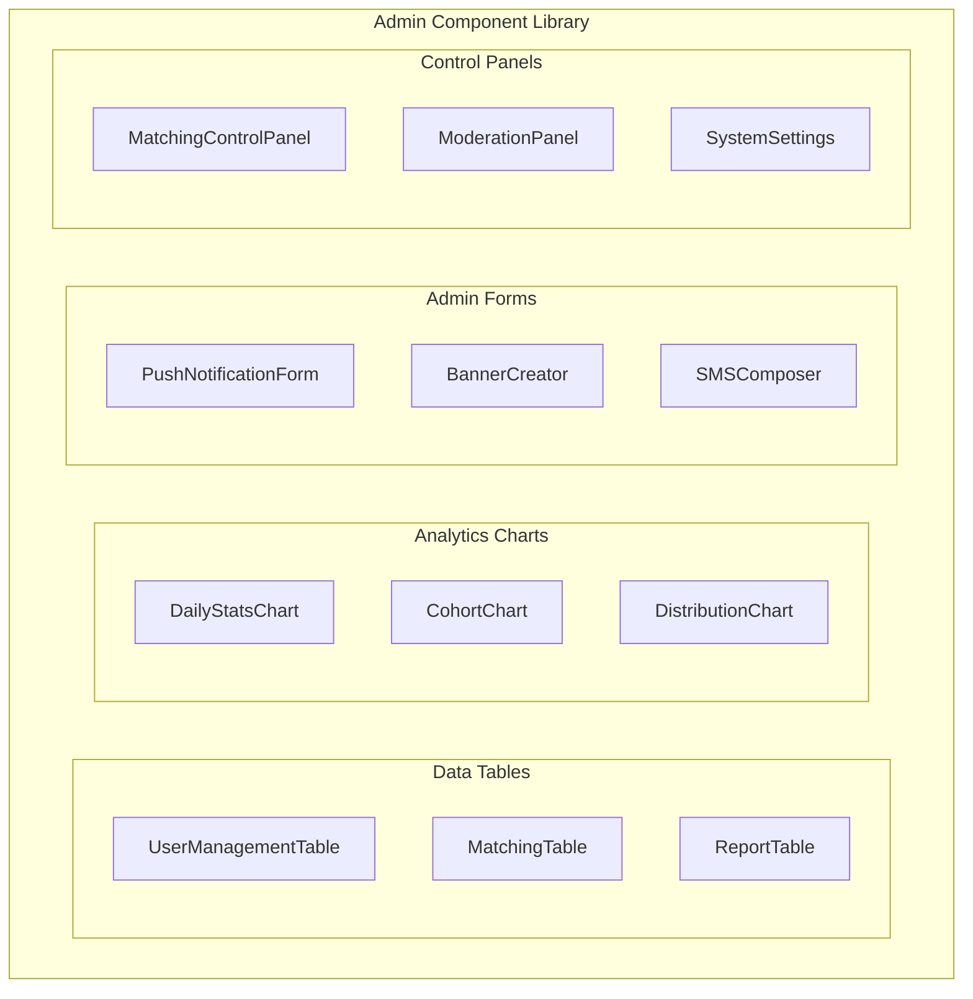
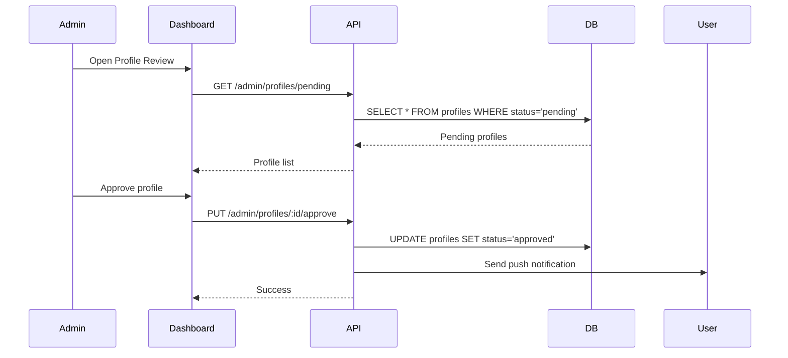
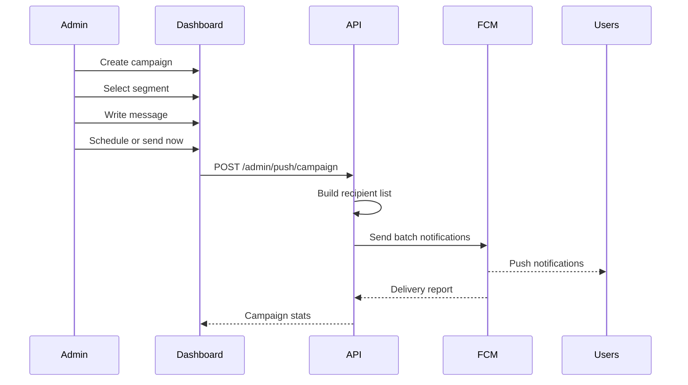

# Project-Solo - Admin Features

## Overview
30+ admin pages for platform management.

## Admin Feature Map

## Admin Page Details

### Dashboard & Analytics

| Page | Purpose | Key Features |
|------|---------|--------------|
| `dashboard` | Overview KPIs | User stats, match rates, revenue |
| `analytics` | Detailed metrics | Demographics, funnels, cohorts |
| `sales` | Revenue tracking | Transactions, refunds, projections |

### User Management

| Page | Purpose | Key Features |
|------|---------|--------------|
| `users` | User CRUD | Search, filter, edit, ban |
| `profile-review` | Approve profiles | Photo review, verification |
| `reports` | Handle violations | Review reports, take action |
| `deleted-females` | Track deletions | Analyze churn |
| `female-retention` | Retention metrics | Re-engagement tools |

### Matching Management

| Page | Purpose | Key Features |
|------|---------|--------------|
| `matching` | Monitor matches | Live matching, manual override |
| `matching-management` | Advanced controls | Algorithm tuning |
| `scheduled-matching` | Scheduled jobs | Time-based matching |
| `rematch` | Rematch requests | Process rematch tickets |
| `likes` | Like analytics | Like patterns, conversions |
| `dormant-likes` | Inactive likes | Re-activation campaigns |

### Communication

| Page | Purpose | Key Features |
|------|---------|--------------|
| `chat` | Chat management | Monitor, moderate |
| `support-chat` | Customer support | Respond to inquiries |
| `push-notifications` | Push campaigns | Segment, schedule, send |
| `sms` | SMS messaging | Bulk SMS, templates |

### Content Management

| Page | Purpose | Key Features |
|------|---------|--------------|
| `community` | Forum moderation | Posts, comments, reports |
| `moment` | Moment questions | Create, schedule, analyze |
| `card-news` | News cards | Create, publish, archive |
| `banners` | Promotional banners | Create, schedule, target |

### Commerce

| Page | Purpose | Key Features |
|------|---------|--------------|
| `gems` | Currency management | Balance, transactions |
| `ios-refund` | Apple refunds | Process IAP refunds |

### System

| Page | Purpose | Key Features |
|------|---------|--------------|
| `universities` | University list | Add, edit, verify |
| `version-management` | App versions | Force update, deprecate |
| `ai-chat` | AI assistant | Test AI responses |
| `lab` | Experimental | Feature flags, A/B tests |

## Admin Service API (123KB)

### Key API Endpoints

| Category | Endpoint | Method | Purpose |
|----------|----------|--------|---------|
| Users | `/admin/users` | GET | List users |
| Users | `/admin/users/:id` | PUT | Update user |
| Users | `/admin/users/:id/ban` | POST | Ban user |
| Matching | `/admin/matching` | GET | List matches |
| Matching | `/admin/matching/force` | POST | Force match |
| Analytics | `/admin/analytics/daily` | GET | Daily stats |
| Analytics | `/admin/analytics/cohort` | GET | Cohort analysis |
| Push | `/admin/push/send` | POST | Send push |
| Push | `/admin/push/segment` | POST | Send to segment |
| SMS | `/admin/sms/send` | POST | Send SMS |
| Gems | `/admin/gems/adjust` | POST | Adjust balance |
| Community | `/admin/posts` | GET | List posts |
| Community | `/admin/posts/:id` | DELETE | Delete post |

## Admin UI Components

## Admin Workflow: Profile Review

## Admin Workflow: Push Notification Campaign

## Role-Based Access

| Role | Dashboard | Users | Matching | Analytics | System |
|------|-----------|-------|----------|-----------|--------|
| `super_admin` | Full | Full | Full | Full | Full |
| `admin` | Full | Read/Write | Read/Write | Read | Limited |
| `moderator` | View | Read | Read | - | - |
| `support` | View | Read | - | - | - |
