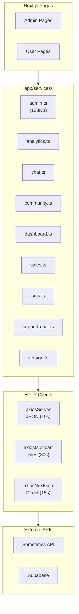
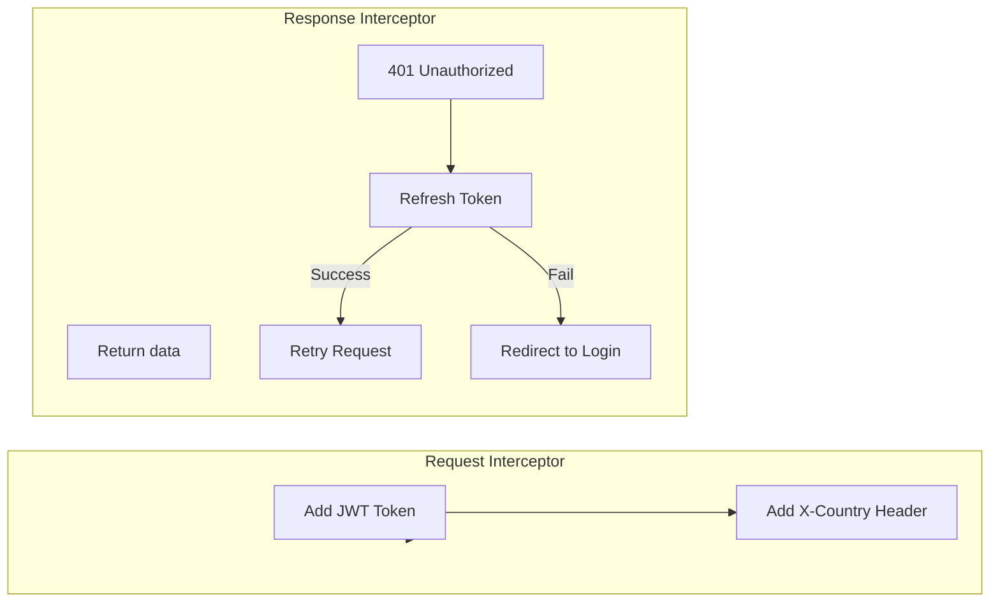
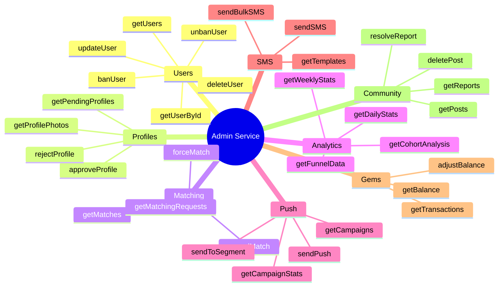
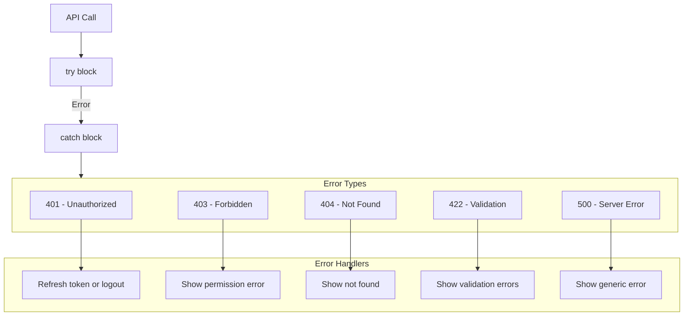

# Project-Solo - API Services

## Overview
Centralized service layer for API communication.

## Service Architecture



## Axios Configuration



```typescript
// utils/axios.ts
const axiosServer = axios.create({
  baseURL: process.env.NEXT_PUBLIC_API_URL,
  timeout: 15000,
  headers: { 'Content-Type': 'application/json' }
});

axiosServer.interceptors.request.use((config) => {
  const token = localStorage.getItem('accessToken');
  const country = localStorage.getItem('selectedCountry') || 'kr';
  
  config.headers.Authorization = `Bearer ${token}`;
  config.headers['x-country'] = country;
  
  return config;
});
```

## Service Functions

### Admin Service (admin.ts)



### Analytics Service (analytics.ts)

| Function | Params | Returns |
|----------|--------|---------|
| `getDailyMetrics` | startDate, endDate | DailyMetrics[] |
| `getUserGrowth` | period | GrowthData |
| `getMatchingStats` | period | MatchingStats |
| `getRevenueReport` | period | RevenueData |
| `getCohortRetention` | cohortDate | RetentionMatrix |

### Chat Service (chat.ts)

| Function | Params | Returns |
|----------|--------|---------|
| `getRooms` | userId | ChatRoom[] |
| `getMessages` | roomId, page | Message[] |
| `sendMessage` | roomId, content | Message |
| `markAsRead` | roomId | void |

### Community Service (community.ts)

| Function | Params | Returns |
|----------|--------|---------|
| `getPosts` | page, filter | Post[] |
| `getPost` | postId | Post |
| `createPost` | data | Post |
| `updatePost` | postId, data | Post |
| `deletePost` | postId | void |
| `getComments` | postId | Comment[] |
| `reportPost` | postId, reason | Report |

### Dashboard Service (dashboard.ts)

| Function | Params | Returns |
|----------|--------|---------|
| `getOverview` | - | DashboardData |
| `getActiveUsers` | - | number |
| `getTodayMatches` | - | number |
| `getTodayRevenue` | - | number |
| `getRecentActivity` | limit | Activity[] |

### Sales Service (sales.ts)

| Function | Params | Returns |
|----------|--------|---------|
| `getTransactions` | page, filter | Transaction[] |
| `getRevenue` | period | RevenueData |
| `getRefunds` | page | Refund[] |
| `processRefund` | transactionId | void |

### SMS Service (sms.ts)

| Function | Params | Returns |
|----------|--------|---------|
| `sendSMS` | phone, message | SMSResult |
| `sendBulk` | phones[], message | BulkResult |
| `getTemplates` | - | Template[] |
| `createTemplate` | data | Template |

### Version Service (version.ts)

| Function | Params | Returns |
|----------|--------|---------|
| `getVersions` | platform | Version[] |
| `createVersion` | data | Version |
| `setMinVersion` | version | void |
| `deprecateVersion` | version | void |

## API Rewrites (next.config.js)

```typescript
// API route rewrites
rewrites: async () => [
  {
    source: '/api/admin/rematch-request',
    destination: `${API_URL}/admin/matching/rematch-request`
  },
  {
    source: '/api/notifications/:path*',
    destination: `${API_URL}/notifications/:path*`
  },
  {
    source: '/api/matchings/:path*',
    destination: `${API_URL}/matchings/:path*`
  },
  {
    source: '/api/offline-meetings/:path*',
    destination: `${API_URL}/offline-meetings/:path*`
  },
  {
    source: '/api/user-preferences',
    destination: `${API_URL}/user-preferences`
  },
  {
    source: '/api/profile',
    destination: `${API_URL}/profile`
  },
  {
    source: '/api/admin/:path*',
    destination: `${API_URL}/admin/:path*`
  }
]
```

## Error Handling



## Type Definitions

```typescript
// app/types/matching.ts
interface Match {
  id: string;
  user1_id: string;
  user2_id: string;
  status: MatchStatus;
  match_date: string;
  match_time: string;
  created_at: string;
}

type MatchStatus = 
  | 'pending'
  | 'accepted'
  | 'rejected'
  | 'expired'
  | 'active'
  | 'completed'
  | 'cancelled';

// app/types/community.ts
interface Post {
  id: string;
  author_id: string;
  content: string;
  emoji: string;
  nickname: string;
  likes: string[];
  reports: string[];
  isDeleted: boolean;
  isEdited: boolean;
  timestamp: string;
}

// app/types/support-chat.ts
interface SupportTicket {
  id: string;
  user_id: string;
  subject: string;
  status: 'open' | 'in_progress' | 'resolved' | 'closed';
  messages: SupportMessage[];
  created_at: string;
}
```
